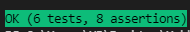

# Suplias PHP UNIT testing challenge

Run this command to install the PHP UNIT testing package

`$ composer install`

Next, run this command to setup autoloading properly

`$ composer dump-autoload -o`

Afterwards, run this command to run tests

`$ ./vendor/bin/phpunit .\tests\PseudoCrudTest.php --color`

You should get an output like this

